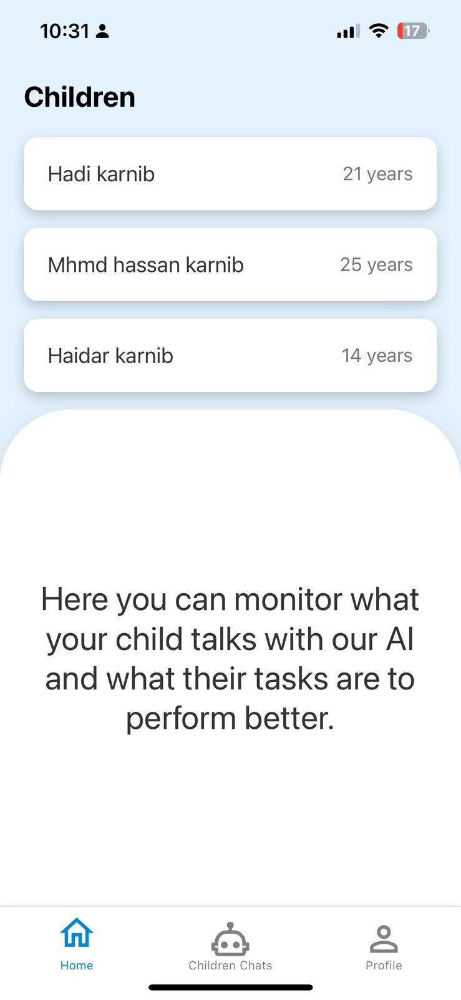
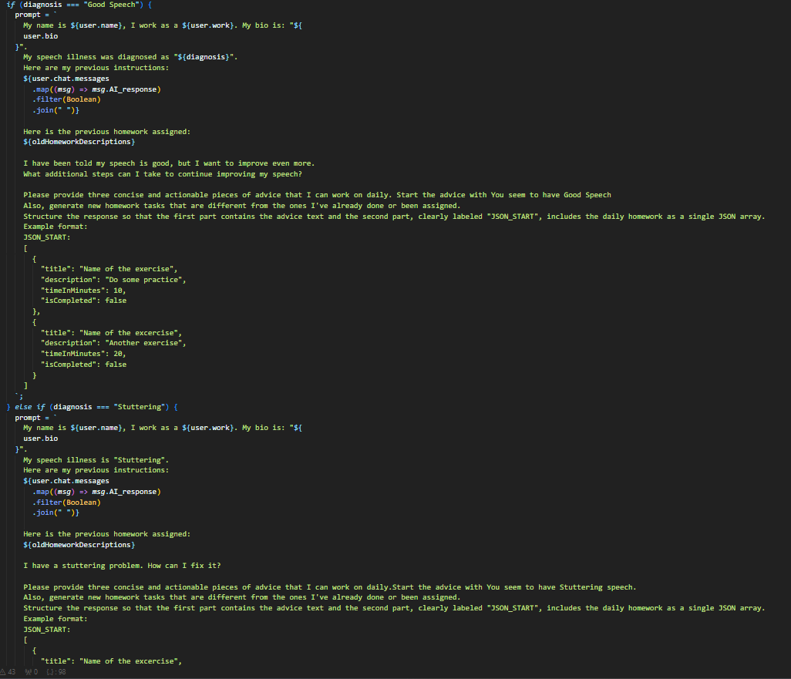
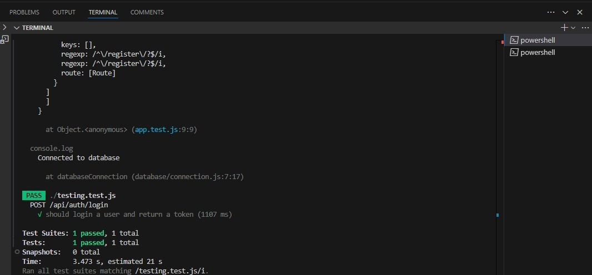

<br><br>

<!-- project philosophy -->


> A web app for empowering individuals with speech and communication challenges, providing accessible and personalized speech therapy at their fingertips.
>
> VerbalBotic aims to transform the traditional speech therapy experience by providing a user-friendly platform that adapts to each user's unique needs. We are dedicated to empowering our users by enhancing their ability to communicate more effectively, focusing on convenience, personalization, and measurable progress to ensure user satisfaction.

### User Stories

- As a user, I want to assess my speech capabilities through the app, so I can understand my areas of improvement.
- As a user, I want to track my progress over time, so I can see how much I have improved and stay motivated.

### Parent Stories

- As a parent, I want to track my child's progress over time, so I can see how much they have improved and check their daily homework.
- As a parent, I want to be able to take advice directly from an ai to know how to handle and interact with my child's illness.

<!-- Tech stack -->


### Empower Speech is built using the following technologies:

- This project uses the [React Native framework](https://reactnative.dev/), a cross-platform mobile development framework that allows us to develop the app for both iOS and Android using a single codebase.
  -For state management, the app utilizes [Redux](https://redux.js.org/), providing a predictable state container for managing application state, including user sessions, data, and notifications.
- For persistent storage (database), the app uses the [MongoDB](https://www.mongodb.com/) a NoSQL database that efficiently manages user data, speech therapy sessions, and progress tracking.
  -Speech analysis is powered by [FastAPI](https://fastapi.tiangolo.com/), a modern Python-based web framework, which integrates machine learning models to assess and provide personalized speech therapy feedback.
- 🚨 Node.js and Express.js are used to manage backend functionalities, including user authentication, session tracking, and interaction with the AI models for speech analysis.
- User audio files and other assets are stored in AWS S3, ensuring secure and scalable file storage for the application.

<br><br>

<!-- UI UX -->


> We designed VerbalBotic using wireframes and mockups, iterating on the design until we reached the ideal layout for easy navigation and a seamless user experience.

- Project Figma design [figma](https://www.figma.com/design/lYKnKzfIaeIFI1TjHdQoq5/VerbalBotic?node-id=0-1&t=BDcVcfxbKnYdKN40-1)

### Mockups

| Home Screen | Chat Screen |

|  |  |

<br><br>

<!-- Database Design -->


### Architecting Data Excellence: Innovative Database Design Strategies:


<br><br>

<!-- Implementation -->


### User Screens (Mobile)

| Login screen                         | Register screen                       | Chats screen                            |
| ------------------------------------ | ------------------------------------- | --------------------------------------- |
|  |  |  |

### Admin Screens (Mobile)

| Home screen                              | Children screen                       | Admin Chats screen                      |
| ---------------------------------------- | ------------------------------------- | --------------------------------------- |
|  |  |  |

<br><br>

<!-- Prompt Engineering -->


### Mastering AI Interaction: Unveiling the Power of Prompt Engineering:

- This project uses advanced prompt engineering techniques to optimize the interaction with natural language processing models. By skillfully crafting input instructions, we tailor the behavior of the models to achieve precise and efficient language understanding and generation for various tasks and preferences.
  

<br><br>

<!-- AWS Deployment -->


### Efficient AI Deployment: Unleashing the Potential with AWS Integration:

- This project leverages AWS deployment strategies to seamlessly integrate and deploy natural language processing models. With a focus on scalability, reliability, and performance, we ensure that AI applications powered by these models deliver robust and responsive solutions for diverse use cases.


<br><br>

<!-- Unit Testing -->


### Precision in Development: Harnessing the Power of Unit Testing:

- This project employs rigorous unit testing methodologies to ensure the reliability and accuracy of code components. By systematically evaluating individual units of the software, we guarantee a robust foundation, identifying and addressing potential issues early in the development process.
  

<br><br>

<!-- How to run -->


> To set up VerbalBotic locally, follow these steps:

### Prerequisites

This is an example of how to list things you need to use the software and how to install them.

- npm
  ```sh
  npm install npm@latest -g
  ```

### Installation

_Below is an example of how you can instruct your audience on installing and setting up your app. This template doesn't rely on any external dependencies or services._

1. Get an API Key at [ChatGpt](https://openai.com)
2. Clone the repo
   git clone [github](https://github.com/hadi-karnib/VerbalBotic.git)
3. Enter your API in `.env file` in the backend

   ```js
   CHATGPT_API = "ENTER YOUR API";
   GOOGLE_API = "ENTER YOUR google api";
   CHAT_MODEL = "ENTER YOUR desired chatgpt model";
   JWT_SECRET = "ENTER YOUR secret";
   MONGO_URI = "ENTER YOUR mongoURI";
   PORT = "ENTER the port to which you will run your backend";
   ```

4. Enter your ip in `.env file` in the frontend

   ```js
   API_URL=http://yourIp:yourBackendPort
   ML_URL=http://yourIp:yourMLPort
   ```

5. Install NPM packages

   ```sh
      cd VerbalBotic-back
      cd Backend
      npm i
      npm run dev # to run the backend ,port is declared in the .env
      # new terminal
      cd VerbalBotic-back
      cd ML
      uvicorn app:app --host 0.0.0.0 --port "desired port"
      # new terminal
      cd VerbalBotic-front
      npm i
      npx expo start --clear
   ```

Now, you should be able to run VerbalBotic locally and explore its features.
